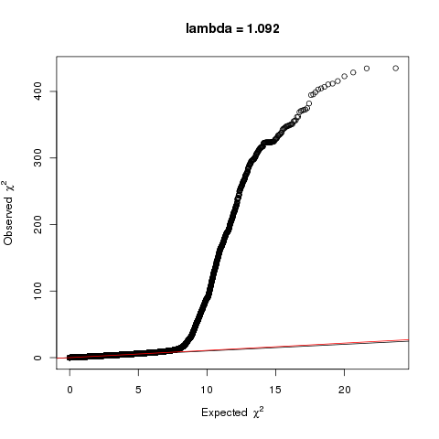
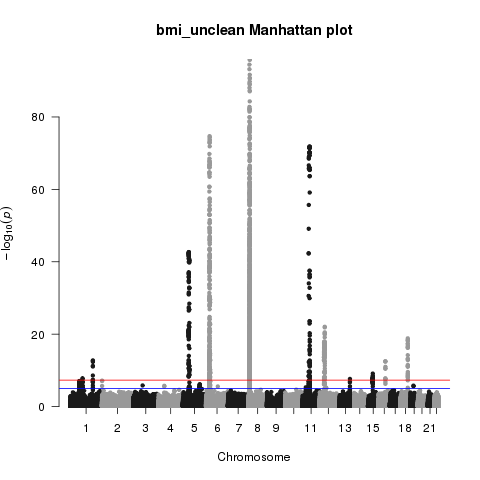

# Practical 3: Genome-wide association study of BMI in Plink
# Answers

> (1) How many individuals are there?

```
[user@newblue4 data]$ wc -l geno_unclean.fam
8237 geno_unclean.fam
```

8237 individuals

> (2) How many SNPs are there?

```
[user@newblue4 data]$ wc -l geno_unclean.bim
463080 geno_unclean.bim
```

463,080 SNPs

> (3) How can we tell there is a problem with this GWAS?



The QQ plot looks inflated and the lambda (genomic inflation) is 1.09 - suggesting some population stratification problems.



There are some suspiciously good hits on the Manhattan plot.

> (4) For each of the parameters below, which SNPs or individuals do you think should be removed?

```
Minor allele frequency <0.01

Hardy Weinberg p-value <1x10-6

SNP missingness >0.05

Individual missingness >0.05
```

Run the QC script using `./qc.sh` or `~/pract3_GWAS/scripts/qc.sh`<br>
Copy the GWAS script using `cp unclean_gwas.sh clean_gwas.sh`<br>
Edit this file using pico so it reads:
```
#!/bin/bash

module load apps/plink2

plink \
        --bfile ../output/geno_qc \
        --linear \
        --pheno ../data/phen.txt \
        --pheno-name BMI \
        --covar ../data/covs.txt \
        --out ../output/bmi_clean


awk 'NR==1 || /ADD/' ../results/bmi_clean.assoc.linear > ../output/bmi_clean.assoc.linear.add
```

Run the script using `./clean_gwas.sh` or `~/pract3_GWAS/scripts/clean_gwas.sh`<br>
View the results file using `head bmi_clean.assoc.linear.add`

Copy the graphs script using `cp unclean_gwas_graphs.sh clean_graphs.sh`<br>
Edit this files using pico so it reads:

```
#!/bin/bash

export R_LIBS="~/R_libs"
mkdir ~/R_libs
module load languages/R-3.2.2-ATLAS

# Here we use the gwas_graphs.R script to generate Q-Q and Manhattan plots
# We pass to R the GWAS results file and the filename for the graphs to be saved to

Rscript ../scripts/gwas_graphs.R ../results/bmi_clean.assoc.linear.add ../output/bmi_clean
```

Run this scripts using `./clean_gwas_graphs.sh`


<br>
<br>

<br>
<br>
<br>

> (5) How many individuals in the final analysis?

```
[user@newblue4 results]$ head bmi_clean.assoc.linear.add
CHR                  SNP         BP   A1       TEST    NMISS       BETA         STAT            P
   1           rs12562034     768448    A        ADD     8237  -0.006193     -0.04969       0.9604
   1            rs9442372    1018704    A        ADD     8237     0.1102        1.419        0.156
   1            rs3737728    1021415    A        ADD     8237    0.09783        1.149       0.2508
   1            rs6687776    1030565    T        ADD     8237     0.1155        1.085       0.2779
   1            rs9651273    1031540    A        ADD     8237   0.002348      0.02745       0.9781
   1            rs4970405    1048955    G        ADD     8237    0.01016        0.081       0.9354
   1           rs12726255    1049950    G        ADD     8237    0.07016       0.6253       0.5318
   1           rs11807848    1061166    C        ADD     8237    0.02641       0.3402       0.7337
   1            rs9442373    1062638    C        ADD     8237    0.04518       0.5878       0.5567
```
NMISS column tells us there are 8237 individuals in the analysis.

> (6) How many genome-wide significant (p<5x10-8) signals do you have?

```
[user@newblue4 results]$ awk '$9<0.00000005' bmi_clean.assoc.linear.add | wc -l
62
```

62 SNPs meet the p<5x10-8 threshold

> (7) Are these likely to all be independent?

```
[user@newblue4 results]$ awk '{if(NR==1 || $9<0.00000005) print $0}' bmi_clean.assoc.linear.add
 CHR                  SNP         BP   A1       TEST    NMISS       BETA         STAT            P
   1            rs1026997   72516287    T        ADD     8237     0.4356        5.658    1.583e-08
   1             rs988421   72549836    C        ADD     8237     0.4347        5.647    1.689e-08
   1            rs1545933   72611715    C        ADD     8237    -0.6325       -6.326    2.641e-10
   1            rs2821296   72629795    C        ADD     8237     0.4732        6.209     5.58e-10
   ...
   ```

Many are nearby SNPs and likely to be in LD, so there is probably only 6 independent associations. <br>
The next step would be to run a conditional analysis to test for secondary signals at each locus.

> (8) What is the top signal?

```
user@newblue4 results]$ grep -v NA bmi_clean.assoc.linear.add | sort -g -k 9 | head
 CHR                  SNP         BP   A1       TEST    NMISS       BETA         STAT            P
  18             rs571312   57839769    A        ADD     8237     0.9811        10.93    1.305e-27
...
```

rs571312. On chromosome 18 at position 57839769.

> (9) How might we go about confirming this finding?

In GWAS we normally seek replication in an independent study. <br>
Because we only test a few SNPs in replication, a significant result is achieved with a higher p-value.
We can also use other data resources to check the plausibility of the signals (see next session)


<br>
<br>

> ﴾10﴿ Are all associated SNPs in high LD?

No, some SNPs in low LD ﴾r2<0.2﴿ are also associated ﴾dark blue points﴿.
This might be a second independent signal or might indicate that rs8050136 is not the causal SNP.

> ﴾11﴿ What genes are nearby?

The signal falls within FTO. There are other genes in the region.
